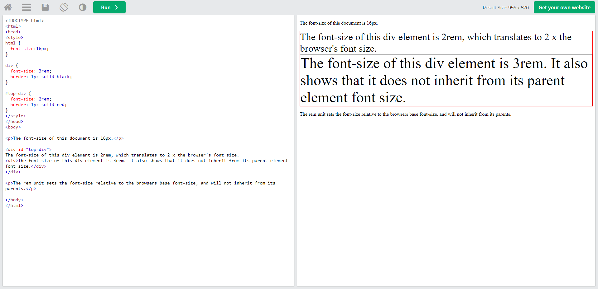
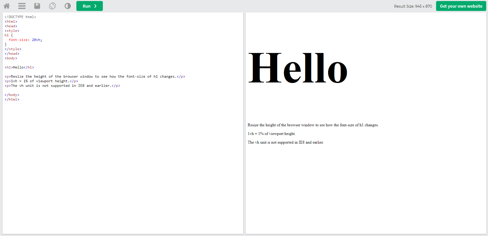
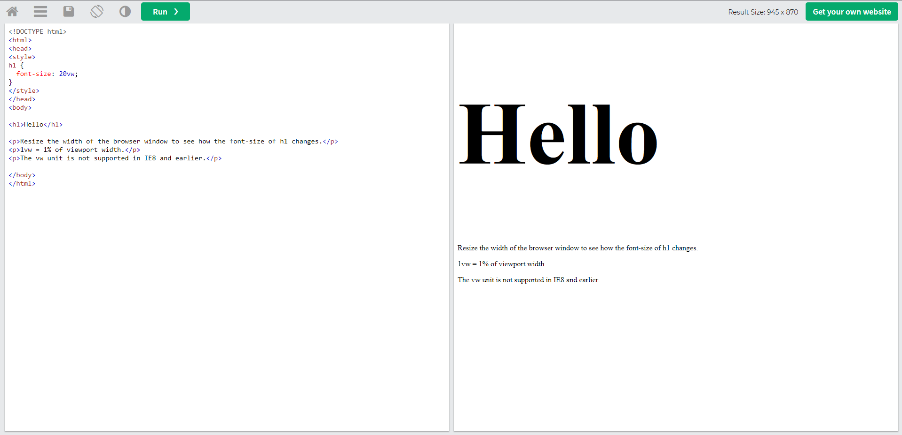

# Unterricht Notizen

### Click the links below to go directly to the respective .md file

### PB / JS

#### [Einführung JS, Statements, Variablen und Datentypen](https://github.com/jacqueline-s-w/git-liste/tree/main/javascript/2022-12-13%20Einf%C3%BChrung%20JS%2C%20Statements%2C%20Variablen%20und%20Datentypen)

#### [Expression, Änderung von Variablen und Coersion](https://github.com/jacqueline-s-w/git-liste/tree/main/javascript/2022-12-14%20Expression%2C%20%C3%84nderung%20von%20Variablen%20und%20Coersion)

#### [String und Grundlegende String-Methoden](https://github.com/jacqueline-s-w/git-liste/tree/main/javascript/2022-12-15%20String%20und%20Grundlegende%20String-Methoden)

#### [Numbers + Math](https://github.com/jacqueline-s-w/git-liste/tree/main/javascript/2023-01-03%20Numbers%20%2B%20Math)

#### [Logisches Denken I, Umgang mit Boolean](https://github.com/jacqueline-s-w/git-liste/tree/main/javascript/2023-01-04%20Logisches%20Denken%20I%2C%20Umgang%20mit%20Boolean)

#### [Arrays und Array-Methoden](https://github.com/jacqueline-s-w/git-liste/tree/main/javascript/202301-05%20Arrays%20und%20Array-Methoden)

---

### Cheatsheets

[**Git Befehle**](https://github.com/jacqueline-s-w/git-liste/blob/main/git-befehle.md)

[**Markdown Befehle**](https://github.com/jacqueline-s-w/git-liste/blob/main/markdown-befehle.md)

[**Terminal Cheat-Sheet**](https://github.com/jacqueline-s-w/git-liste/blob/main/terminal-cheat-sheet.md)

[**HTML und CSS Cheat-Sheets**](https://github.com/jacqueline-s-w/git-liste/blob/main/html-css-cheatsheets.md)

---

### UIB

#### [Boxmodell](https://github.com/jacqueline-s-w/git-liste/tree/main/boxmodell)

#### [Background Images + Positioning](https://github.com/jacqueline-s-w/git-liste/tree/main/2022-10-24%20Background%20Images%20%2B%20Positioning)

#### [UI UX + Inline Text Semantics + Font Family](https://github.com/jacqueline-s-w/git-liste/tree/main/2022-10-25%20UI%20UX%20%2B%20Inline%20Text%20Semantics%20%2B%20Font%20Family)

#### [Font Sizing - Direction und Alignment - Stylish text](https://github.com/jacqueline-s-w/git-liste/tree/main/2022-10-26%20Font%20Sizing%20-%20Direction%20und%20Alignment%20-%20Stylish%20text)

#### [Icon Fonts](https://github.com/jacqueline-s-w/git-liste/tree/main/2022-10-27%20Icon%20Fonts)

#### [Farben + Shadows](https://github.com/jacqueline-s-w/git-liste/tree/main/2022-11-03%20Farben%20%2B%20Shadows)

#### [Tabellen](https://github.com/jacqueline-s-w/git-liste/tree/main/2022-11-07%20Tabellen)

#### [Forms](https://github.com/jacqueline-s-w/git-liste/tree/main/2022-11-08%20Forms)

#### [Forms Styling](https://github.com/jacqueline-s-w/git-liste/tree/main/2022-11-09%20Forms%20Styling)

#### [Responsive Design](https://github.com/jacqueline-s-w/git-liste/tree/main/uib/2022-11-10%20Responsive%20Design)

#### [Layout + Flexbox I](https://github.com/jacqueline-s-w/git-liste/tree/main/uib/2022-11-14%20Layout%20%2B%20Flexbox%20I)

#### [Flexbox II](https://github.com/jacqueline-s-w/git-liste/tree/main/uib/2022-11-15%20Flexbox%20II)

#### [Flex Wiederholung + Grid part 1](https://github.com/jacqueline-s-w/git-liste/tree/main/uib/21.11.2022_flex_wiederholung_%2B_grid_part_one_22.11.2022)

#### [Grid Part 2](https://github.com/jacqueline-s-w/git-liste/tree/main/uib/23.11.2022_Grid_Tag_Part_2)

#### [Grid Area und Animation](https://github.com/jacqueline-s-w/git-liste/tree/main/uib/24.11.2022_Grid_Area_und_Animation)

#### [Animations](https://github.com/jacqueline-s-w/git-liste/tree/main/uib/29.11.2022_animations)

#### [SASS](https://github.com/jacqueline-s-w/git-liste/tree/main/uib/30.11.2022_SASS)

---

### Info Graphics

