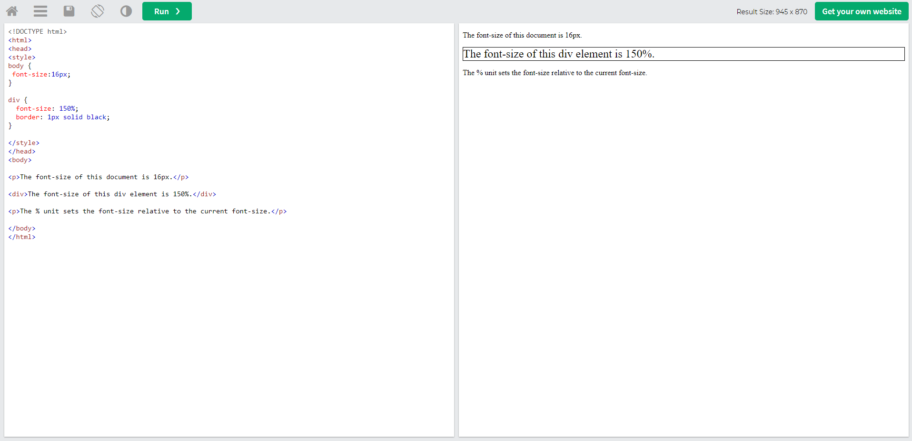
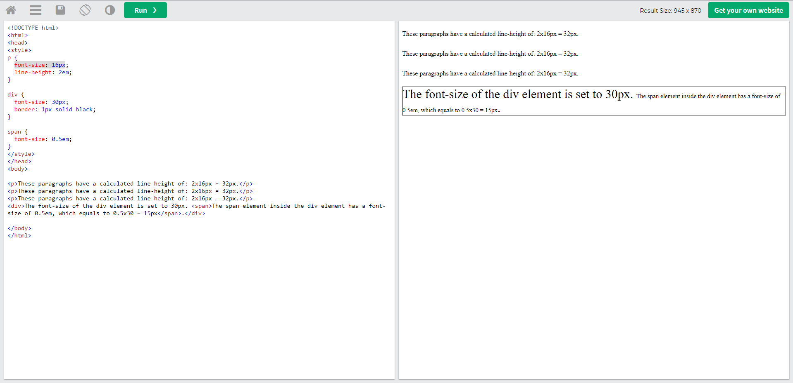

# Unterricht Notizen

### Click the links below to go directly to the respective .md file

[**Git Befehle**](https://github.com/jacqueline-s-w/git-liste/blob/main/git-befehle.md)

[**Markdown Befehle**](https://github.com/jacqueline-s-w/git-liste/blob/main/markdown-befehle.md)

[**Terminal Cheat-Sheet**](https://github.com/jacqueline-s-w/git-liste/blob/main/terminal-cheat-sheet.md)

[**HTML und CSS Cheat-Sheets**](https://github.com/jacqueline-s-w/git-liste/blob/main/html-css-cheatsheets.md)

#### [Boxmodell](https://github.com/jacqueline-s-w/git-liste/tree/main/boxmodell)

#### [Background Images + Positioning](https://github.com/jacqueline-s-w/git-liste/tree/main/2022-10-24%20Background%20Images%20%2B%20Positioning)

#### [UI UX + Inline Text Semantics + Font Family](https://github.com/jacqueline-s-w/git-liste/tree/main/2022-10-25%20UI%20UX%20%2B%20Inline%20Text%20Semantics%20%2B%20Font%20Family)

#### [Font Sizing - Direction und Alignment - Stylish text](https://github.com/jacqueline-s-w/git-liste/tree/main/2022-10-26%20Font%20Sizing%20-%20Direction%20und%20Alignment%20-%20Stylish%20text)

#### [Icon Fonts](https://github.com/jacqueline-s-w/git-liste/tree/main/2022-10-27%20Icon%20Fonts)

#### [Farben + Shadows](https://github.com/jacqueline-s-w/git-liste/tree/main/2022-11-03%20Farben%20%2B%20Shadows)

#### [Tabellen](https://github.com/jacqueline-s-w/git-liste/tree/main/2022-11-07%20Tabellen)

#### [Forms](https://github.com/jacqueline-s-w/git-liste/tree/main/2022-11-08%20Forms)

#### [Forms Styling](https://github.com/jacqueline-s-w/git-liste/tree/main/2022-11-09%20Forms%20Styling)
---

### Info Graphics

