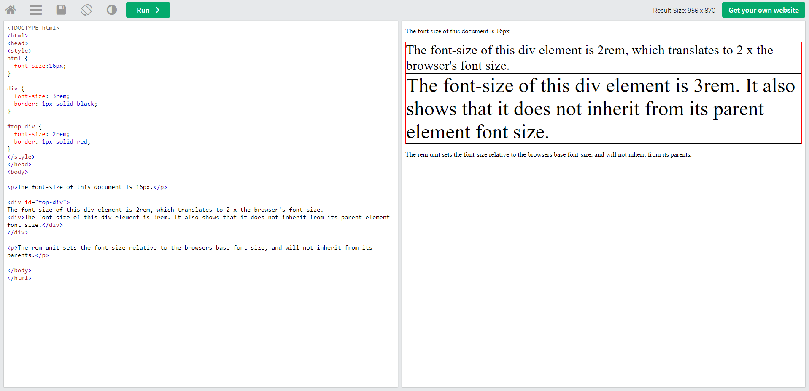
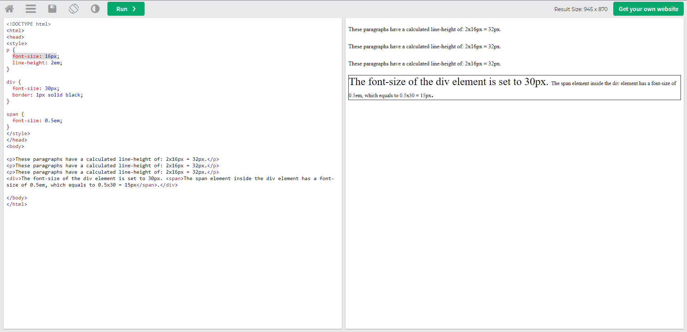
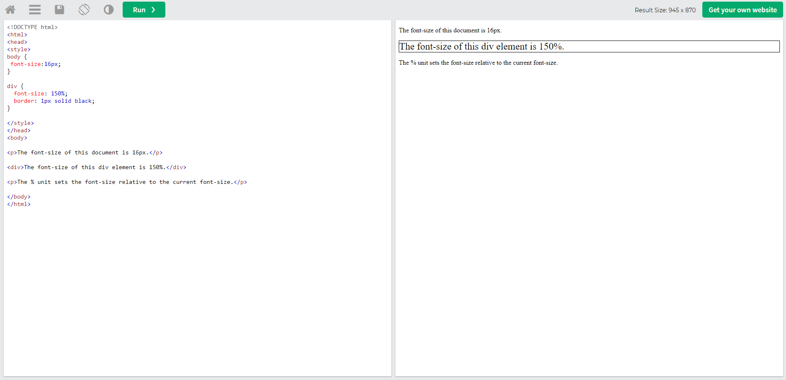
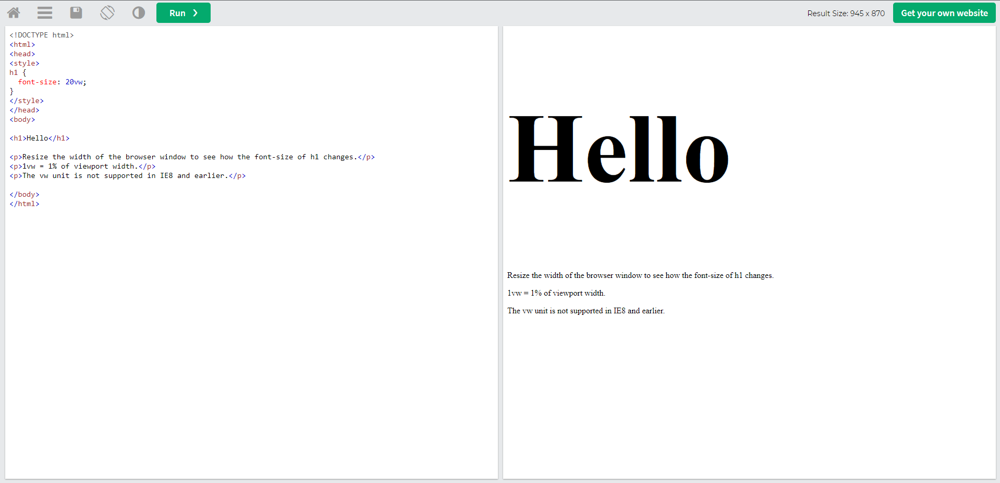

# HTML und CSS Cheat-Sheet

# **HTML (Hyper Text Markdown Language)**

## Grundstruktur eines HTML- Gerüsts

```HTML
 <!DOCTYPE html>
<html lang="en">
<head>
    <meta charset="UTF-8">
    <meta http-equiv="X-UA-Compatible" content="IE=edge">
    <meta name="viewport" content="width=device-width, initial-scale=1.0">
    <title>Document</title>
</head>
<body>

</body>
</html>
```

#### `!Doctype: `

Sagt dem Browser welche Computersprache benutzt wird (hier: HTML)

#### `lang=""`

gibt die Sprache an (hier: Englisch)

#### **metatags:**

```html
<meta charset="UTF-8" />
```

> macht ä,ü,ö lesbar

### `<a>`

> The `<a>` tag defines a hyperlink, which is used to link from one page to another.

> The most important attribute of the `<a> `element is the href attribute, which indicates the link's destination.

> By default, links will appear as follows in all browsers:

> An unvisited link is underlined and blue
> A visited link is underlined and purple
> An active link is underlined and red

**Example
Create a link to W3Schools.com:**

```html
<a href="https://www.w3schools.com">Visit W3Schools.com!</a>
```

### `<ul>` (ungeordente Liste)

- Item Eins
- Item zwei
- Item Drei

### `<ol>` (geordnete Liste)

1. Item Eins
2. Item Zwei
3. Item Drei

### `<li>`

Tag für die einzelnen Listenelemente

**Beispiel für listenelemente in einer OL**

```html
<ol>
  <li>Item Eins</li>
  <li>Item Zwei</li>
  <li>Item Drei</li>
</ol>
```

---

# **CSS**

## CSS Pseudoklassen

Bei Pseudoklassen handelt es sich um einfache Selektoren, die ein Element dann ansprechen, wenn es eine bestimmte Eigenschaft besitzt. So lassen sich zum Beispiel Elemente auswählen, über denen sich gerade der Mauszeiger befindet oder Elemente, die das erste Kindelement eines anderen Elementes sind.

Eine Pseudoklasse beinhaltet einen doppelpunkt (:) gefolgt von einem pseudoklassen namen (z. B. `:hover`)

Beispiel:

```css
/* Any button over which the user's pointer is hovering */
button:hover {
  color: blue;
}
```

[Quelle 1](https://wiki.selfhtml.org/wiki/CSS/Tutorials/Selektoren/Pseudoklasse), [Quelle 2](https://developer.mozilla.org/en-US/docs/Web/CSS/Pseudo-classes?retiredLocale=de)

---

## CSS Color:

### RGB

Ein RGB Farbwert besteht aus den ROT, GRÜN und BLAU werten.

```css
p {
  color: rgb(50, 150, 255);
}
```

### RGBA

Ein RGBA Farbwert besteht aus den ROT, GRÜN, BLAU und ALPHA (deckkraft/transparenz) werten.

Der Alphawert

```css
p {
  /* in diesem fall wird die deckkraft/transparenz der farbe auf 50% gesetzt */
  color: rgba(50, 150, 255, 0.5);
}
```

### HEX

Ein Hex Code für farben ist ein weg den RGBA Farbwert (besteht aus den ROT, GRÜN, BLAU werten) auszugeben

```css
p {
  color: #00bfff;
}
```

---

## Class / ID Selectors

### Class

Eine Klasse wird mit einem `.` angesprochen. Mit klassen kann man mehrere Elemente gleichzeitig ansprechen.
Es können mehrer Klassen in einem Element benutzen werden.

###### HTML

```html
<p class="blue-text bold-text"></p>
```

###### CSS

```css
.blue-text {
  color: blue;
}
.bold-text {
  font-weight: bold;
}
```

### ID

Eine ID wird mit einem `#` angesprochen.
ID's sind einzigartig (wie z.B. eine Personalausweisnummer) und können somit auch jeweils für ein element genutzt werden.

###### HTML

```html
<p id="orange-text">lorem</p>
<p id="green-text">lorem</p>
```

###### CSS

```css
#orange-text {
  color: orange;
}
#green-text {
  color: green;
}
```

---

## CSS Units

### px (Pixel)

> Größeneinheit in Pixel

### rem (root em)

> ändert die größe relativ zur Schriftgröße vom Root (HTML)- Element



### em

> ändert die Größe relativ zur Schriftgröße zum derzeitigen Element (2em bedeutet doppelte Größe der derzeitigen Schriftart)



### %

> **Größeneinheit in Prozent (relativ zum Elternelement)** > 

### vh ( Relative to 1% of the height of the viewport)


### vw ( Relative to 1% of the width of the viewport)


